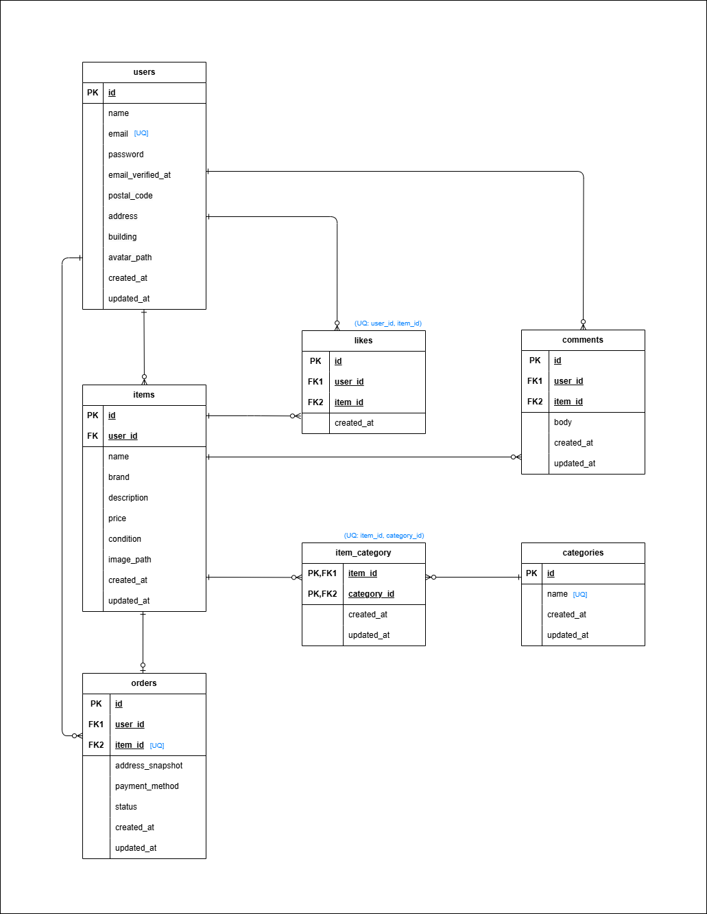

# Freemarket App

Laravel 11 + Docker


---

## 環境構築手順

### 1. リポジトリのクローン

```bash
git clone https://github.com/mao716/freemarket-app.git
cd freemarket-app
```

### 2. Docker コンテナの起動

```bash
docker compose up -d --build
```

### 3. Laravel の依存関係インストール（初回のみ）

すでに `src/` ディレクトリに Laravel 本体は含まれています。
クローン後は以下のコマンドで依存関係（vendor/）をインストールしてください。

```bash
docker compose exec php bash
cd /var/www
composer install
exit
```

### 4. Laravel の環境変数設定

Laravel をインストールすると、`src/.env.example` が自動生成されます。
以下のコマンドで `.env` を作成してください。

```bash
cp src/.env.example src/.env
```

その後、 `.env` の該当箇所を以下のように編集し、Docker の MySQL コンテナに接続できるように設定してください。

```env
DB_CONNECTION=mysql
DB_HOST=mysql
DB_PORT=3306
DB_DATABASE=laravel_db
DB_USERNAME=laravel_user
DB_PASSWORD=laravel_pass

SESSION_DRIVER=file
SESSION_LIFETIME=120
```

### 5. Stripe設定（テストモード）

本アプリは Stripe のテストモードを使用しています。
決済処理を行うには、Stripeアカウントを作成しテスト用APIキーを取得後、 `.env` に設定してください。

```env
STRIPE_KEY=pk_test_xxxxxxxxxxxxxxxxxxxxx
STRIPE_SECRET=sk_test_xxxxxxxxxxxxxxxxxxxxx
```
※ 現在の実装では Webhook 機能（STRIPE_WEBHOOK_SECRET）は使用していません。

### 6. Laravel の初期設定

```bash
docker compose exec php bash
cd /var/www

# アプリケーションキーの生成
php artisan key:generate

# ストレージリンクの作成
php artisan storage:link

# マイグレーション実行
php artisan migrate

# シーディング（ダミーデータ投入）
php artisan db:seed

exit
```
---

## 動作環境

- PHP 8.2 (php-fpm)
- Laravel 11
- Nginx 1.21
- MySQL 8.0
- phpMyAdmin
- Docker / Docker Compose

---

## 使用技術

- fortify
- form request
- stripe

---

## アクセス方法

- アプリケーション: <http://localhost>
- phpMyAdmin: <http://localhost:8080>
  - ユーザー: `laravel_user`\
  - パスワード: `laravel_pass`

---

## ER 図



---

## 今後の TODO

- モデル・コントローラ・ビューの実装
- バリデーション、Seeder の実装
- 最終的に基本設計書・テーブル仕様書との整合性を確認
